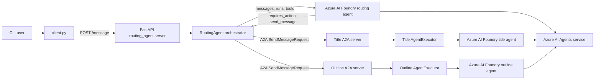
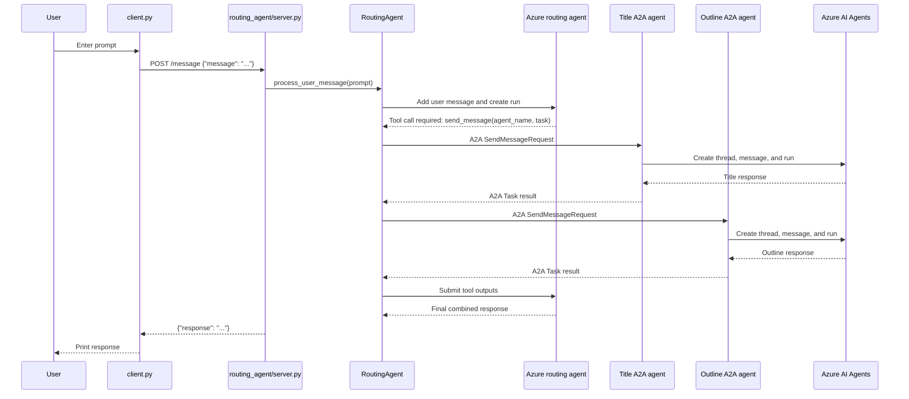

# System Architecture: Remote Agents with A2A

## Summary

This sample is a local multi-process Python application that demonstrates agent-to-agent
(A2A) orchestration with Azure AI Foundry agents.

The user interacts with a CLI client. The client sends prompts to a routing API. The
routing agent uses an Azure AI Foundry agent as the decision-making orchestrator and
delegates specialized tasks to two remote A2A agents:

- Title agent: generates blog post titles.
- Outline agent: generates article outlines.

Each specialized A2A agent wraps its own Azure AI Foundry agent and returns task results
to the routing agent.

## Component Diagram



## Runtime Sequence



## Startup Flow

`python/run_all.py` is the local orchestrator for development:

1. Loads environment variables from `python/.env`.
2. Starts the title agent server with uvicorn.
3. Waits for the title agent `/health` endpoint.
4. Starts the outline agent server with uvicorn.
5. Waits for the outline agent `/health` endpoint.
6. Starts the routing agent server with uvicorn.
7. Waits for the routing agent `/health` endpoint.
8. Starts the interactive CLI client.
9. Terminates server subprocesses when the client exits.

## Main Components

### CLI Client

File: `python/client.py`

- Reads `SERVER_URL` and `ROUTING_AGENT_PORT` from the environment.
- Accepts user input in a loop.
- Sends `POST /message` to the routing API.
- Prints the returned response.

### Routing API

File: `python/routing_agent/server.py`

- Provides the public HTTP interface for the local sample.
- Exposes `POST /message` for prompts.
- Exposes `GET /health` for readiness checks.
- Initializes `RoutingAgent` during FastAPI lifespan startup.

### Routing Agent

File: `python/routing_agent/agent.py`

- Discovers remote A2A agents by resolving their agent cards.
- Stores remote agent connections by agent name.
- Creates an Azure AI Foundry routing agent.
- Registers `send_message(agent_name, task)` as a Foundry function tool.
- Sends A2A requests to selected remote agents.
- Submits A2A task results back to the Azure routing run.
- Returns the final assistant response from the routing thread.

### Title Agent A2A Server

Files:

- `python/title_agent/server.py`
- `python/title_agent/agent_executor.py`
- `python/title_agent/agent.py`

Responsibilities:

- Publishes an A2A `AgentCard` named `Microsoft Foundry Title Agent`.
- Advertises the `generate_blog_title` skill.
- Handles A2A task requests with `FoundryAgentExecutor`.
- Runs an Azure AI Foundry agent instructed to generate one clear, catchy blog title.

### Outline Agent A2A Server

Files:

- `python/outline_agent/server.py`
- `python/outline_agent/agent_executor.py`
- `python/outline_agent/agent.py`

Responsibilities:

- Publishes an A2A `AgentCard` named `AI Foundry Outline Agent`.
- Advertises the `generate_outline` skill.
- Handles A2A task requests with `OutlineAgentExecutor`.
- Runs an Azure AI Foundry agent instructed to generate a concise article outline.

## External Services and Libraries

External service:

- Azure AI Agents service, accessed through `azure-ai-agents`.

Main Python dependencies:

- `a2a-sdk`
- `azure-ai-agents`
- `azure-ai-projects`
- `azure-identity`
- `fastapi`
- `starlette`
- `uvicorn`
- `httpx`
- `python-dotenv`

## Environment Contract

The sample expects these environment variables in `python/.env` or the shell environment:

- `PROJECT_ENDPOINT`: Azure AI Foundry project endpoint.
- `MODEL_DEPLOYMENT_NAME`: model deployment used by all Foundry agents.
- `SERVER_URL`: host used for local services.
- `TITLE_AGENT_PORT`: title A2A server port.
- `OUTLINE_AGENT_PORT`: outline A2A server port.
- `ROUTING_AGENT_PORT`: routing API port.

Do not log or commit secret values. The current architecture only needs these variable
names, not their contents.

## Network Interfaces

### Routing API

- `POST /message`
  - Input: JSON object with a `message` string.
  - Output: JSON object with either `response` or `error`.

- `GET /health`
  - Output: JSON health status.

### A2A Agent Servers

Both specialized agents expose routes generated by `A2AStarletteApplication`, including
the A2A agent card endpoint used by `A2ACardResolver`.

Each specialized agent also exposes:

- `GET /health`
  - Title response: `AI Foundry Title Agent is running!`
  - Outline response: `AI Foundry Outline Agent is running!`

## Data Flow

1. User prompt enters through `client.py`.
2. `client.py` sends the prompt to `routing_agent/server.py`.
3. `RoutingAgent` adds the prompt to its Azure AI thread and starts a run.
4. Azure routing agent decides whether to call the registered `send_message` tool.
5. `send_message` creates an A2A `SendMessageRequest`.
6. The selected remote A2A server receives the task.
7. The remote server's executor extracts the text part from the A2A message.
8. The remote Foundry agent processes the task in its own Azure thread.
9. The executor completes the A2A task with the Foundry response.
10. The routing agent submits the remote result as a tool output.
11. The Azure routing agent produces the final response.
12. The routing API returns the response to the CLI client.

## State and Persistence

- A2A task state is held in `InMemoryTaskStore`.
- Each specialized agent caches its Azure agent object in memory after creation.
- Each specialized agent creates a new Azure thread per conversation request.
- The routing agent creates one Azure thread during initialization and reuses it while
  the process is running.
- There is no application database or durable local persistence in this sample.

## Observed Implementation Notes

These notes describe the current code shape and likely maintenance risks:

- `python/outline_agent/server.py` currently reads `TITLE_AGENT_PORT` for its `port`
  variable. The intended variable appears to be `OUTLINE_AGENT_PORT`.
- `python/routing_agent/server.py` has a direct `__main__` path using
  `os.getenv["ROUTING_AGENT_PORT"]`, which should be callable syntax if that path is
  used. `run_all.py` avoids this path by starting uvicorn with the module target.
- `python/routing_agent/agent.py` contains import-time routing agent initialization at
  the bottom of the file, while `routing_agent/server.py` also initializes the routing
  agent during FastAPI lifespan startup. The lifespan approach is the clearer runtime
  model.
- Error handling is mostly user-facing strings and `print` statements. Production use
  would need structured logs, request IDs, redaction, and stable error codes.

## Local Verification

Run from the Python sample directory:

```powershell
cd C:\Users\valer\PROJECTS\AI_projects\learnings\azure_AI-103T00-A_traning\06-build-remote-agents-with-a2a\python
python run_all.py
```

Expected behavior:

1. Title agent health check succeeds.
2. Outline agent health check succeeds.
3. Routing agent health check succeeds.
4. CLI prompts for input.
5. A request such as `Create a title and outline for an article about React programming.`
   is routed through the remote agents and returns a combined response.
